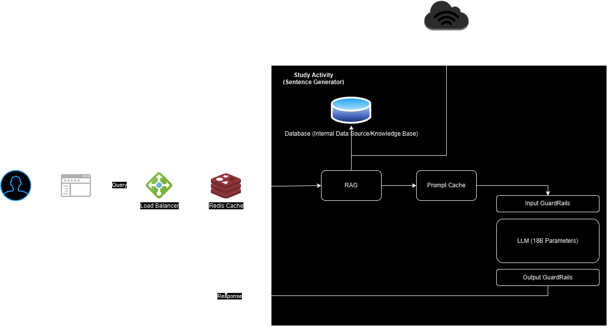

# Architecting GenAI

## Requirements

### Overview

Based in Kansas City, MO, our company is dedicated to providing high-quality, culturally relevant language education through an innovative and user-friendly application. Our primary goal is to support a globally dispersed student base, currently numbering 1,500 and growing by 150 students annually, by offering personalized learning experiences that cater to diverse backgrounds and proficiency levels. We aim to leverage cutting-edge AI and machine learning technologies to create adaptive learning paths and interactive tools, ensuring an engaging and effective learning journey. As we expand our library of languages and enhance our platform, we are committed to maintaining scalability, security, and user satisfaction, positioning ourselves as a leader in the language education market with significant growth potential.

### Business Requirements

- **Goals and Objectives**: Ensure the application supports the company's mission to provide high-quality, culturally relevant language education. Aim for user growth and retention, and support the expansion of the language library.
- **Market Differentiation**: We will use Generative AI tools to curate personalized learning experiences, setting us apart by tailoring content and interactive exercises to each student's needs.

### Functional Requirements

- **User Management**: Registration, authentication, and profile management.
- **Content Delivery**: Interactive lessons, multimedia content, and quizzes.
- **Progress Tracking**: Dashboards for tracking learning progress and achievements.
- **Community Features**: Forums, discussion boards, and language exchange partnerships.
- **AI-Powered Tools**: Chatbots, speech recognition, adaptive learning paths, and optical character recognition (OCR) to enhance writing skills in languages like Japanese, Arabic, and Mandarin Chinese.
  
### Non-functional Requirements

- **Performance**: Ensure the application is responsive and can handle high traffic volumes.
- **Scalability**: Design for scalability to accommodate the growing user base and expanding content.
- **Security**: Implement robust security measures to protect user data and ensure compliance with regulations.
- **Usability**: Ensure the application is user-friendly and accessible to users with varying levels of technical proficiency.

### Tooling

- GenAI vs ML:
  - **Generative AI**: Use for creating personalized content, chatbots, and interactive exercises.
  - **Machine Learning**: Use for adaptive learning paths, performance analytics, and speech recognition.
  
### Risks

- **Technical Risks**:  Potential issues with the availability of AI/ML platforms and models, risks associated with hosting services (self-hosting vs. cloud hosting), and challenges in managing data security and ensuring redundancy of user data.
- **Project Risks**: Delays in development, budget overruns, and changes in business/stakeholder requirements.
- **Operational Risks**: User adoption challenges, maintenance issues, and support requirements.

### Assumptions

- **User Growth**: Assuming a steady growth rate of 150 students per year.
- **Resource Availability**: Assuming access to necessary technical resources and expertise.
- **User Engagement**: Assuming users will actively engage with the application and utilize its features.

### Constraints

- **Budget**: Fixed budget for development and maintenance.
- **Timeline**: Specific deadlines for project milestones and final delivery.
- **Regulatory Compliance**: Adherence to data protection regulations (e.g., GDPR, CCPA).
- **Technical Limitations**: Constraints related to existing infrastructure and technology stack.
